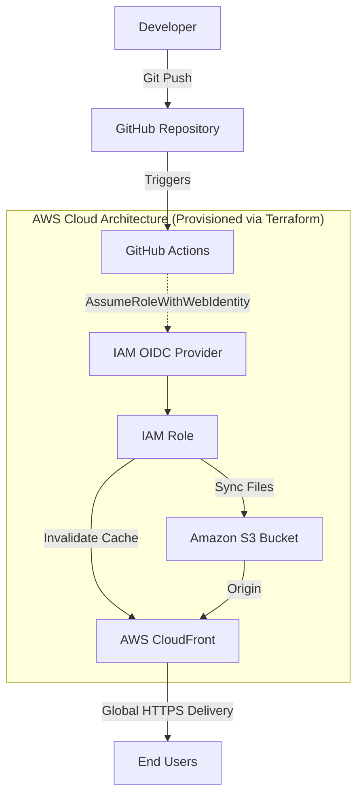

# Serverless Portfolio Infrastructure & Deployment Guide

A fully automated, highly available, and secure serverless infrastructure deployment built with modern DevOps, IaC, and Cloud engineering practices. This guide provides step-by-step instructions to replicate this architecture.

## 🏗 Architecture Overview



---

## 📋 Prerequisites

Before cloning and deploying this project, ensure you have the following accounts and tools ready:

1. **Accounts Needed:**
   - **AWS Account:** With permissions to create IAM roles, S3 buckets, and CloudFront distributions.
   - **Firebase Account:** A free Google account to use Firebase for database and authentication.
   - **GitHub Account:** To host the repository and run CI/CD pipelines.

2. **Local Tools Installed:**
   - [Git](https://git-scm.com/downloads)
   - [Terraform CLI](https://developer.hashicorp.com/terraform/downloads) (v1.0+)
   - [AWS CLI](https://docs.aws.amazon.com/cli/latest/userguide/getting-started-install.html) (v2)

3. **Local Configuration:**
   - Configure your AWS CLI locally by running `aws configure` and providing your temporary or admin access keys.

---

## 🚀 Step 1: Firebase Configuration (Database & Auth)

We use Firebase to make the portfolio dynamic (storing projects, skills, etc.) without managing a backend server.

1. Go to the [Firebase Console](https://console.firebase.google.com/) and create a new project.
2. Enable **Firestore Database** in `Production Mode`.
3. Secure your database by navigating to the **Rules** tab and applying the following security rules:
   ```javascript
   rules_version = '2';
   service cloud.firestore {
     match /databases/{database}/documents {
       match /portfolio/{document} {
         allow read: if true; // Public can read the portfolio
         // Only the specific admin email can modify data
         allow write: if request.auth != null && request.auth.token.email == "YOUR_EMAIL@gmail.com";
       }
     }
   }
   ```
4. Enable **Firebase Authentication** using the `Email/Password` provider and create your admin user.
5. Go to **Project Settings**, register a web app, and copy the `firebaseConfig` object. Paste this object into both `index.html` and `admin.html` in your repository.

---

## ☁️ Step 2: Infrastructure Provisioning (AWS & Terraform)

We use Terraform to provision the S3 bucket for hosting and the CloudFront distribution for CDN.

1. Navigate to the infrastructure folder (e.g., `cd infra`).
2. Update the `main.tf` file to reflect your desired globally unique S3 bucket name.
3. Run the following commands to provision the infrastructure:
   ```bash
   terraform init
   terraform plan
   terraform apply
   ```
4. Once completed, Terraform will output your CloudFront Distribution URL. Note this URL down.

---

## 🔐 Step 3: Zero-Trust Security (GitHub Actions OIDC)

To allow GitHub Actions to deploy to AWS without storing static, long-lived access keys in GitHub Secrets, we set up OpenID Connect (OIDC).

1. Go to **AWS IAM > Identity Providers** and add an `OpenID Connect` provider.
   - **Provider URL:** `https://token.actions.githubusercontent.com`
   - **Audience:** `sts.amazonaws.com`
2. Create a new **IAM Role** (e.g., `GitHubActionsDeployRole`) with a custom Trust Policy allowing `AssumeRoleWithWebIdentity` restricted to your GitHub repository and the `main` branch.
3. Attach an IAM permissions policy to this role allowing `s3:PutObject`, `s3:DeleteObject` for your bucket, and `cloudfront:CreateInvalidation` for your CloudFront distribution.
4. Copy the **Role ARN** and add it to your GitHub Repository:
   - Go to `Settings > Secrets and variables > Actions > New repository secret`.
   - Name: `AWS_ROLE_ARN`
   - Value: Your copied ARN.

---

## ⚙️ Step 4: CI/CD Pipeline Configuration

Automate the deployment process so that every push to the `main` branch updates the live site.

1. In `.github/workflows/deploy.yml`, ensure the following permissions are set to allow OIDC to work:
   ```yaml
   permissions:
     id-token: write
     contents: read
   ```
2. Update the workflow steps to use your `AWS_ROLE_ARN`, your S3 bucket name, and your CloudFront distribution ID.
3. Commit and push your code to GitHub. The GitHub Action will run, authenticate securely with AWS, sync your files to S3, and invalidate the CloudFront cache automatically.

---

## 💻 Step 5: Admin Panel & Content Management

1. Visit your live CloudFront URL.
2. Navigate to `/admin.html` (e.g., `https://your-id.cloudfront.net/admin.html`).
3. Log in using the email and password you created in Firebase Auth.
4. You can now dynamically add, edit, or delete projects, skills, and your CV link. Changes are saved to Firestore and instantly reflected on the main page.
