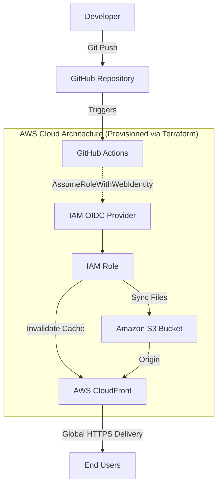

# Serverless Portfolio Infrastructure

A fully automated, highly available, and secure serverless infrastructure deployment built with modern DevOps, IaC, and Cloud engineering practices.

## 🏗 Architecture Overview

## 🚀 Key DevOps Implementations

### 1. Infrastructure as Code (IaC)
- **Terraform:** The entire AWS infrastructure (S3, CloudFront, IAM policies) is strictly codified using Terraform.
- **Remote State:** Terraform state is securely managed in a remote AWS S3 backend, preventing local drift and maintaining a single source of truth.

### 2. Zero-Trust Security (OIDC)
- **Keyless Deployment:** Eliminated the use of long-lived, static AWS IAM Access Keys.
- **OpenID Connect (OIDC):** Configured a trust relationship between GitHub Actions and AWS. The CI/CD pipeline dynamically assumes an AWS IAM role using short-lived JWT tokens.
- **Least Privilege:** The assumed IAM Role is strictly scoped with custom policies allowing only `s3:Sync` for the specific bucket and `cloudfront:CreateInvalidation` for the specific distribution.
- **XSS Protection:** Implemented HTML sanitization on the admin dashboard to prevent Stored XSS attacks.

### 3. Continuous Integration & Delivery (CI/CD)
- **GitHub Actions:** Automated deployment pipeline triggered on every push to the `main` branch.
- **Pipeline Workflow:** 
  1. Source code checkout.
  2. Secure AWS authentication via OIDC.
  3. Delta synchronization of static assets to the S3 bucket.
  4. Automated CloudFront edge cache invalidation to ensure immediate global propagation.

### 4. High Availability & Content Delivery
- **Amazon S3:** Highly durable origin storage for static assets.
- **AWS CloudFront:** Global Content Delivery Network (CDN) enforcing strict `HTTPS` and providing edge caching for ultra-low latency worldwide.
- **Serverless CMS:** The site uses Firebase Firestore and Auth as a serverless backend for content management, eliminating the need for traditional web servers.

---
**Looking to build a similar project?** 
Check out the detailed guides:
- [📖 How To Build It (English)](How-To-Build-It-EN.md)
- [📖 كيف تبني مشروع مشابه (Arabic)](How-To-Build-It-AR.md)
